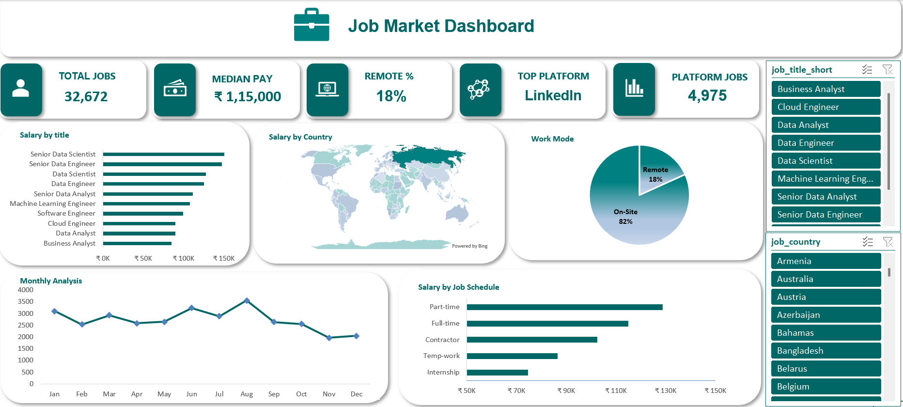
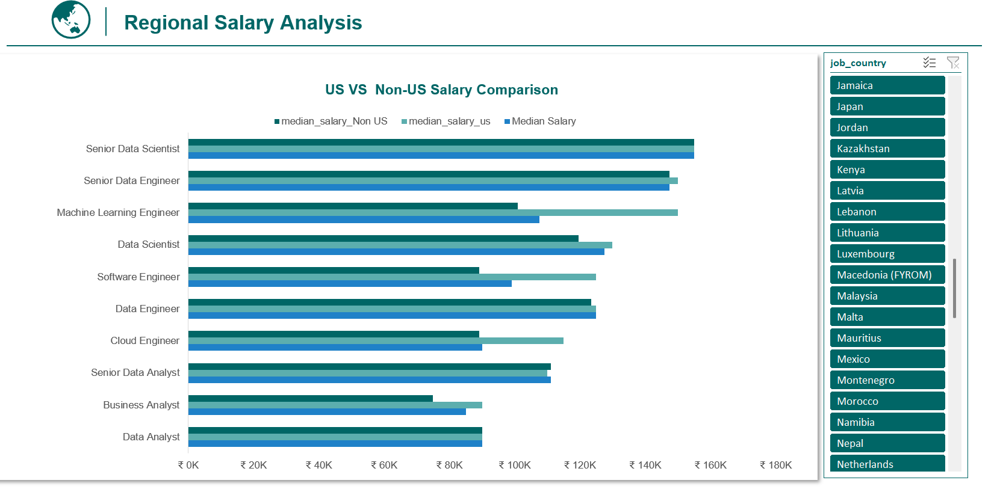
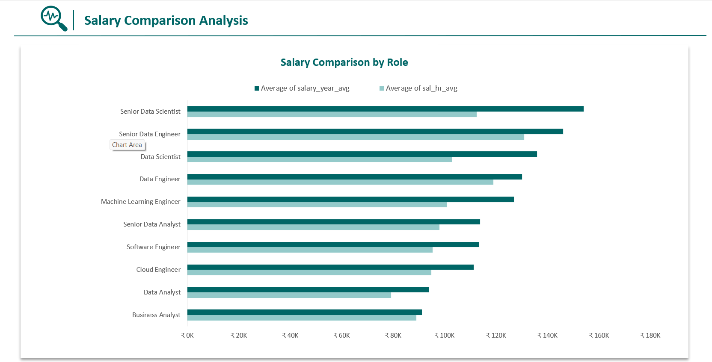
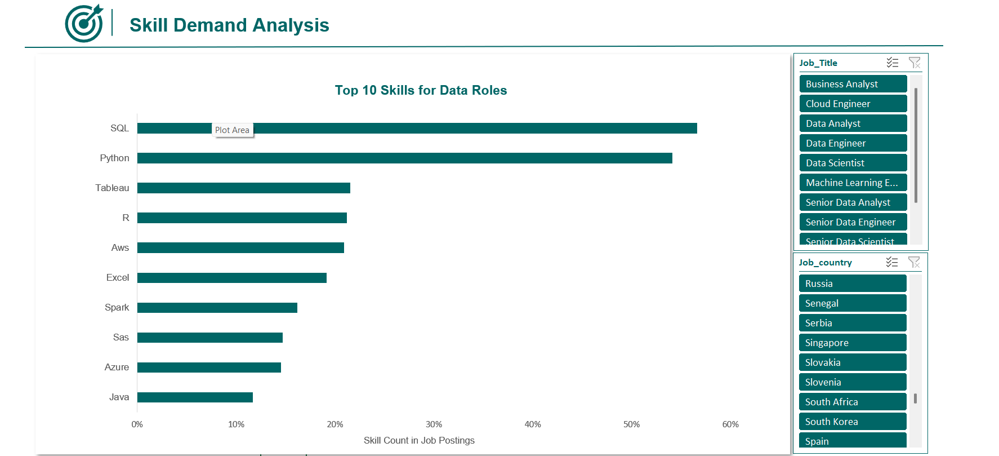
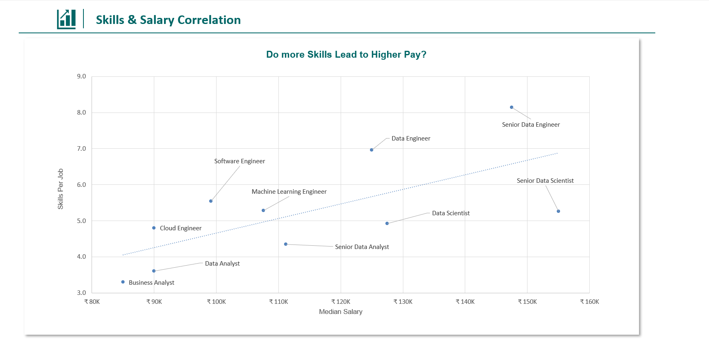
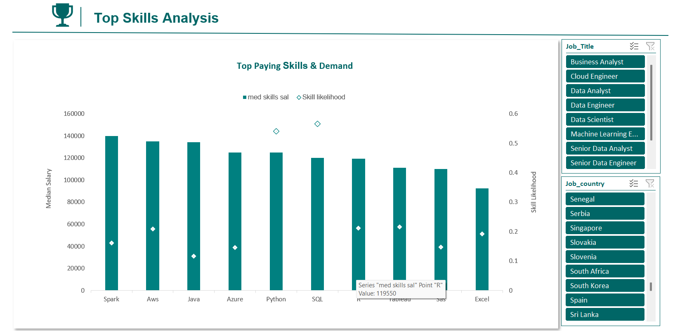
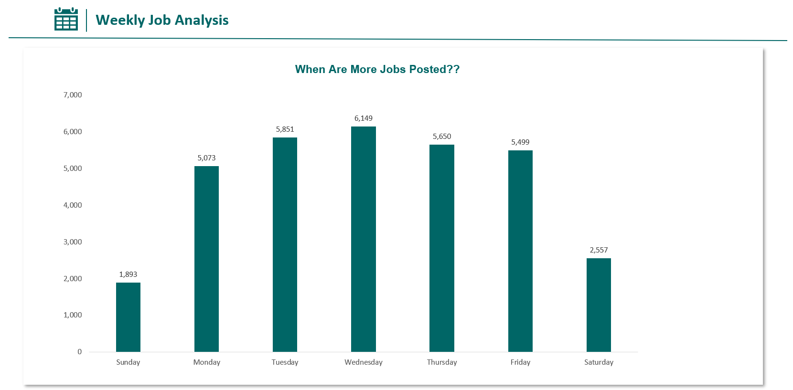

# 📊 Job Market Analysis – Excel Dashboard

## 📌 Project Overview

An interactive **Excel-based Job Market Analysis Dashboard** designed to analyze **job demand, salary patterns, work modes, skill demand, and job posting trends** across data-related roles.

The project transforms raw job market data using **Power Query, Data Model, explicit measures, Pivot Tables, charts, and interactive slicers** to generate meaningful insights.

## 🎯 Project Objective

To analyze **job market demand, salary trends, work patterns, and skill requirements** across job roles, countries, platforms, and time periods to identify key employment and compensation patterns.

## 🖼️ Dashboard Preview

### 📊 Main Dashboard



**Main Dashboard:** Provides an overall view of job market performance through KPIs, salary comparisons, work mode analysis, job posting trends, and job schedule analysis.

### 🌍 Regional Analysis



**Regional Analysis:** Compares salary patterns between **US and non-US job markets**.

### 💰 Salary Comparison



**Salary Comparison:** Analyzes salary differences across job roles and other relevant job-market dimensions.

### 🧠 Skill Demand Analysis



**Skill Demand Analysis:** Examines the demand for different skills across data-related job roles.

### 📈 Skill vs Pay



**Skill vs Pay:** Analyzes the relationship between **skill demand and salary levels**.

### 💎 Top Paying Skills



**Top Paying Skills:** Identifies skills associated with higher salary levels.

### 📅 Weekly Job Analysis



**Weekly Job Analysis:** Examines weekly job posting patterns to identify changes in job demand over time.

## 📊 Key KPIs

- 💼 **Total Jobs**
- 💰 **Median Salary**
- 🏠 **Remote Work Percentage**
- 🏆 **Top Platform**
- 📊 **Platform Job Count**

## 📈 Main Dashboard Analysis

The dashboard analyzes:

- Salary by Country
- Salary by Job Title
- Work Mode
- Monthly Job Posting Trends
- Salary by Job Schedule

### 🎛️ Interactive Filters

- Job Title
- Country

## 🧹 Data Preparation & Modeling

- Cleaned and transformed data using **Power Query**
- Performed data formatting and unpivoting for skill analysis
- Created relationships using the **Data Model**
- Built calculations using **explicit measures**
- Structured the data for dashboard and report analysis

## 🛠️ Tools & Technologies

**Microsoft Excel** • **Power Query** • **Data Model & Relationships** • **Pivot Tables** • **Charts & Visualizations** • **Slicers** • **Explicit Measures**

## 📁 Project Structure

```text
📊 Job-Market-Analysis-Excel/
│
├── 📊 Job_Market_Dashboard.xlsx
│
├── 🖼️ images/
│   ├── dashboard_overview.png
│   ├── regional_analysis.png
│   ├── salary_comparison.png
│   ├── skill_demand_analysis.png
│   ├── skill_vs_pay.png
│   ├── top_paying_skills.png
│   └── weekly_job_analysis.png
│
└── 📄 README.md
```

## 📝 Conclusion

This project demonstrates how **Excel can be used for end-to-end data analysis**, combining data cleaning, transformation, modeling, calculations, and interactive visualization to analyze **job demand, salary trends, work modes, skill requirements, and job posting patterns**.
